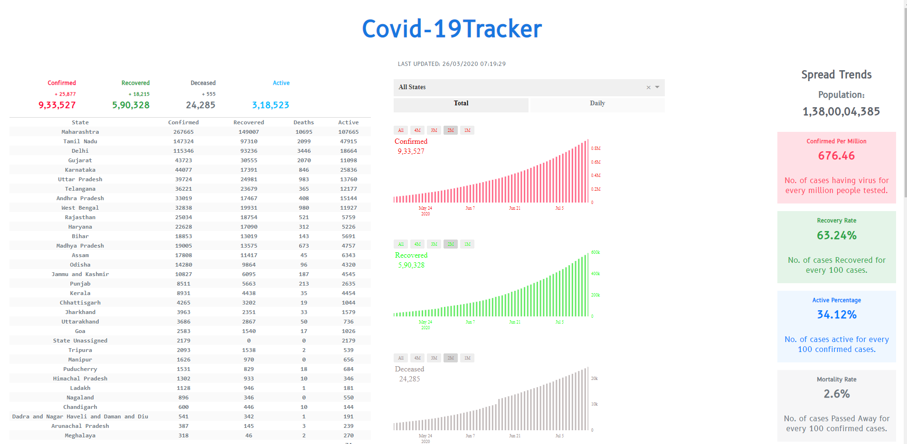
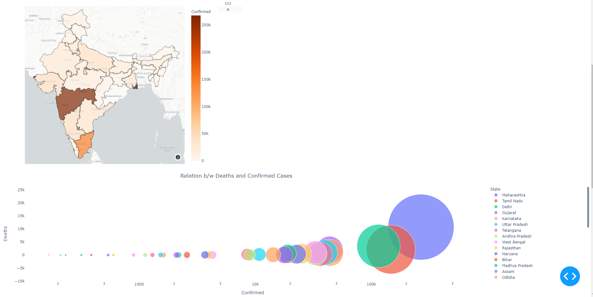
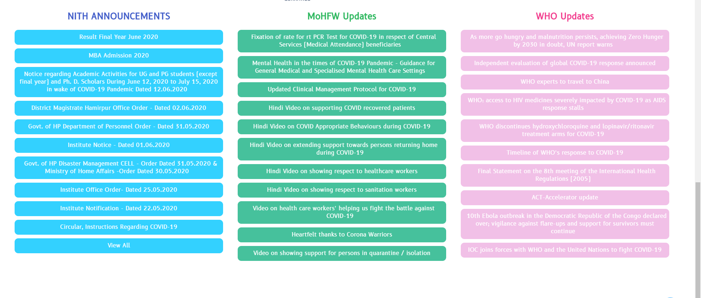

# covid-19-tracker

[](https://forthebadge.com)
[](https://forthebadge.com)
[](https://forthebadge.com)

Deployed at : [https://covid-19-co.herokuapp.com/](https://covid-19-co.herokuapp.com/)


## Contributors

 - [Kashish Srivastava](https://github.com/cannibalcheeseburger) - 185014
 - [Dipesh Chopra](https://github.com/dopesh28) - 185015
 - [Akash Rana](https://github.com/akaxhrana) - 185034

 ## Installation

 - [Python 3.7.6](https://www.python.org/downloads/)

 - Build from source
 
```
git clone https://github.com/cannibalcheeseburger/covid-19-tracker.git
cd covid-19-tracker
```

 - Requirements
```
python -m pip install -r requirements.txt
```

 - Running program
 ```
python app.py
 ```

## Bharo kuch

 

## Usage

 - Run The Script
```
python app.py
```
 - open [http://127.0.0.1:8050/](http://127.0.0.1:8050/) on your broser.

 

 

 


 ## APIs

All of the API used to for retrieving datasets can pe found at : [https://api.covid19india.org/csv/](https://api.covid19india.org/csv/)

 - [https://api.covid19india.org/csv/latest/state_wise.csv](https://api.covid19india.org/csv/latest/state_wise.csv)

 - [https://api.covid19india.org/csv/latest/state_wise_daily.csv](https://api.covid19india.org/csv/latest/state_wise_daily.csv
)

 - [https://api.covid19india.org/csv/latest/state_wise_daily.csv](https://api.covid19india.org/csv/latest/state_wise_daily.csv
)

 - [https://api.covid19india.org/csv/latest/case_time_series.csv](https://api.covid19india.org/csv/latest/case_time_series.csv)